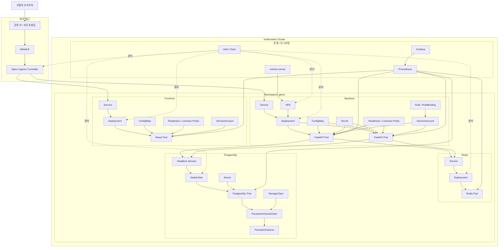

*실습을 하며 진행했지만 이해하는데 도움이 되고자 k8s 배운 내용을 최대한 활용하여 간단한 서비스를 만들어보려 함*

> [!info] 
> VM 3대로 구성한 Kubernetes 클러스터 환경에 React + FastAPI + PostgreSQL + Redis 기반의 실시간 테트리스 게임 서비스 설계·개발·배포 프로젝트  
> WebSocket을 활용해 실시간 랭킹 기능 구현  
> Kubernetes의 Deployment, StatefulSet, Service, Ingress, ConfigMap, Secret, PVC, RBAC, HPA를 실제 서비스 구조에 적용  
> Helm으로 매니페스트 패키징, Prometheus/Grafana로 리소스 및 트래픽 상태 모니터링하여 클라우드 네이티브 운영 환경 구성

## 프로젝트 목표

>1. **k8s** : Namespace, Pod, Controller(Deployment/StatefulSet), Service, Ingress, PV/PVC, StorageClass, ConfigMap, Secret, ServiceAccount, RBAC, Probe, HPA, Qos Class 등 주요 컴포넌트와 운영 요소를 실제 서비스에 적용
>2. **운영 자동화/가시성** : Helm을 통한 패키징, Prometheus 모니터링, 실시간 WebSocket 통신 구현
>3. **외부 서비스** : 로컬 VM 클러스터를 외부망에 노출
>4. **클라우드 네이티브 설계** : React(FE) + FastAPI(BE) + PostgreSQL(DB) + Redis(Cache) 조합의 서비스 구축

- **k8s의 핵심 요소를 모두 활용한 실시간 게임 서비스**를 직접 개발하고, VM 클러스터 환경에 배포하여 외부 접속까지 성공시키기

## 로드맵

1. **[인프라 및 클러스터 구축](Experience/MGC_SA_Bootcamp/5_Kubernetes/20_etc_proj/01_pre.md)**
	- **환경** : VM 3대(Master 1, Worker 2) 준비
	- **구현** : `kubeadm`, `Calico(CNI)`, `metrics-server`, `Ingress`, `MetalLB`, `StorageClass` 준비
	- **핵심** : `kubectl`로 노드 상태 정상 확인

2. **[애플리케이션 개발](Experience/MGC_SA_Bootcamp/5_Kubernetes/20_etc_proj/02_app.md)** (Claude Code 활용)
	- **구현** :
		- FE : 테트리스 게임 UI (React)
		- BE : FastAPI 기반 게임 로직 & WebSocket 실시간 랭킹 API
		- DB : PostgreSQL(유저 데이터), Redis(랭킹 캐시)
	- **핵심** : `Dockerfile` 작성 및 컨테이너 이미지 준비

3. **[쿠버네티스 매니페스트 및 Helm 패키징](Experience/MGC_SA_Bootcamp/5_Kubernetes/20_etc_proj/03_Kubernetes.md)**
	- **구현** : Deployment, Service, Ingress 등 Kubernetes 리소스 YAML 작성
	- **활용** : ConfigMap(설정), Secret(DB 패스워드), PV/PVC(DB 데이터 영속성), RBAC(보안 권한)
	- **핵심** : Helm Chart로 패키징하여 `values.yaml` 기반 환경 설정 관리

4. **[트래픽 제어 및 외부 노출](Experience/MGC_SA_Bootcamp/5_Kubernetes/20_etc_proj/04_Connect.md)**
	- **구현** :
		- **Ingress Controller** : Nginx 설치 및 외부 트래픽 수용
		- **HPA** : 트래픽 증가에 따른 자동 스케일링 설정
		- **Networking** : `MetalLB`를 활용한 외부 접속 경로 확보

5. **[모니터링 및 고도화](Experience/MGC_SA_Bootcamp/5_Kubernetes/20_etc_proj/05_Monitoring_Scaling_CICD.md)**
	- **구현** : `kube-prometheus-stack` (Helm chart) 설치
	- **핵심** : Grafana 대시보드로 게임 서버 리소스(CPU/Memory)와 실시간 트래픽 상태 모니터링

## 요약

| **단계**         | **주요 학습/구현 항목**                     |
| -------------- | ----------------------------------- |
| **인프라**        | `kubeadm` 클러스터 / Ingress Controller |
| **애플리케이션**     | FastAPI(WebSocket) / React / DB 연동  |
| **Kubernetes** | PV/PVC, ConfigMap, Secrets, RBAC    |
| **관리/확장**      | **Helm Chart**, HPA (자동 스케일링)       |
| **운영/모니터링**    | Prometheus + Grafana, 외부 노출         |

## Frontend

React 기반 게임 UI
- **Deployment**로 관리
- **Service**를 통해 Ingress와 연결
- 일반 설정값은 **ConfigMap**
- 상태 확인은 **Readiness/Liveness Probe**
- 기본 계정을 그대로 쓰지 않도록 **ServiceAccount** 적용 가능

## Backend

FastAPI 기반 게임 서버
- 점수 저장 API
- 실시간 랭킹 API
- WebSocket 랭킹 송신
- Redis/PostgreSQL 연동

## DB

|**구분**|**도구**|**역할**|**저장 데이터**|**특징**|
|---|---|---|---|---|
|**인메모리 캐시**|**Redis**|실시간 랭킹 계산|유저별 현재 점수, 랭킹 보드(Sorted Set)|메모리 기반, 초고속 읽기/쓰기|
|**영구 저장소**|**PostgreSQL**|데이터 영속성 관리|모든 게임 로그, 유저별 최고 기록(Best Score)|디스크 기반, 데이터 안전 보관|

**데이터 흐름 (워크플로우)**

1. **게임 종료/점수 전송** : 
	- 게임 끝날 시 → 백엔드(FastAPI)가 점수 받음
	- **Redis** : `ZADD leaderboard <점수> <UUID>` 명령어로 실시간 랭킹 즉시 업데이트
	- **PostgreSQL** : 동일한 시점에 `INSERT INTO game_logs (user_id, score) VALUES (...);` 쿼리를 보내 점수 이력을 저장

2. **랭킹 조회 (실시간 20위)** :
	- FE가 랭킹 페이지 호출 시 → BE는 Redis에서 `ZREVRANGE leaderboard 0 19 WITHSCORES` 명령어로 데이터 가져와 즉시 보여줌
	- PostgreSQL은 부하 감소 목적으로 실시간 랭킹 조회 시 직접 조회 X

3. **최고 기록 조회 (내 기록)** : 
	- 사용자 자신의 최고 기록 확인 시 → BE는 PostgreSQL에서 `SELECT MAX(score) FROM game_logs WHERE user_id = 'UUID';` 쿼리를 실행해 결과를 가져옴

**쿠버네티스 리소스 적용 점**

- **Redis (Deployment)** :
	- 데이터가 휘발되어도 랭킹 시스템은 다시 채우기 가능
	- 간단한 `Deployment`로 띄움 / 필요 시 `enptyDir` 볼륨으로도 충분

- **PostgreSQL (StatefulSet + PVC)** :
	- 점수 데이터 휘발 X
	- `StatefulSet`을 사용하여 고유 ID 부여
	- `PVC(Persistent Volume Claim`를 통해 VM의 특정 디스크 마운트하여 컨테이너 죽어도 데이터 유지

- **Secret 관리** :
	- PostgreSQL의 관리자 비밀번호, 유저 접속 정보 → YAML에 평문 X
	- `Secret`리소스를 사용해 보안 유지

- **Namespace**: `game`
- **Pod**: 각 애플리케이션 실행 단위
- **Controller**: Deployment, StatefulSet
- **YAML**: 전체 리소스 선언형 구성
- **Service**: 내부 통신
- **Ingress**: 외부 진입점
- **PV/PVC**: PostgreSQL 영속성
- **StorageClass**: PVC 동적 바인딩
- **ConfigMap**: 일반 설정값
- **Secret**: 비밀번호/민감정보
- **Helm**: 배포 패키징
- **Probe**: 상태 점검
- **HPA**: backend 자동 확장
- **QoSClass**: requests/limits로 간접 적용
- **ServiceAccount**: Pod 실행 신원 분리
- **RBAC**: ServiceAccount 권한 제어

**추가 보완 사항**

- **비동기 처리** :
	- 사용자 게임 끝날 시 DB 저장 과정 길어지면 끊김
	- → FastAPI 에서 `BackgroundTasks`를 사용해 DB 저장 작업을 비동기로 처리
		- 성능 향상

- **Redis 복구** :
	- Redis 죽었을 때 랭킹 초기화
	- → Redis의 **RDB/AOF(데이터 스냅샷/로그)** 기능을 설정하여 해당 디렉토리를 `PVC`로 연결

## 최종 아키텍처

---

## 진행 로그

- [VM 클러스터 구축](Experience/MGC_SA_Bootcamp/5_Kubernetes/20_etc_proj/01_pre.md)